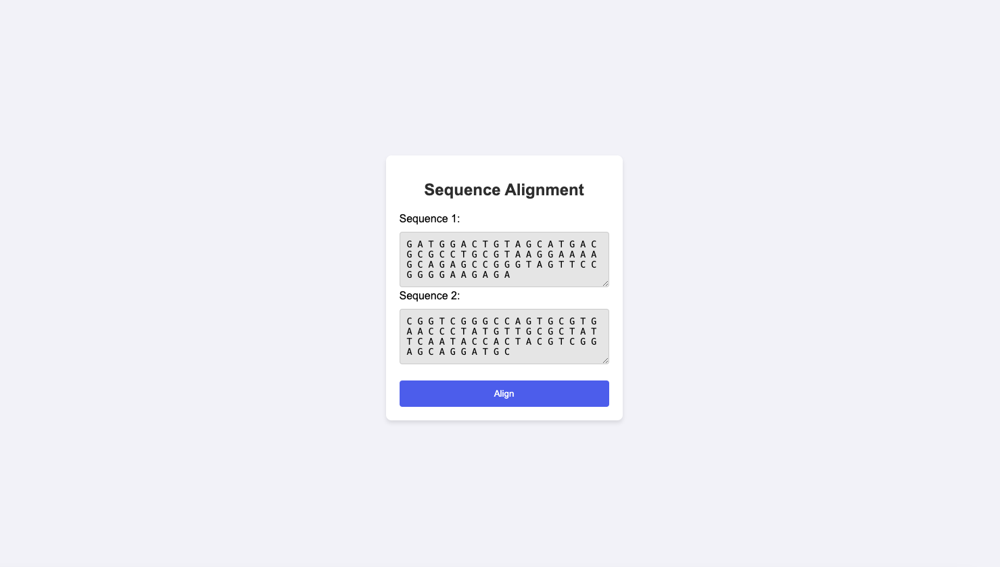

# Sequence-alignment-py-web



Sequence alignment web app using PyTorch and Flask.

## How to use
```
pip install -r requirements.txt
```
```
python app.py
```

## TODO
- [ ] Upload files
- [ ] More options (e.g GPU/CPU(current option), pairwise/elementwise(current option))
